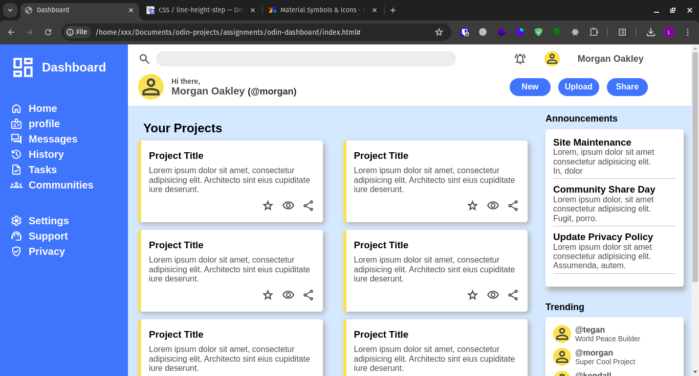

# Dashboard

Basic project to practice layout techniques learned from **"The Odin Project"**. This project is not fully responsive. The project have slight difference but are for personal preferences, also most of the project is not using grid layout, also use flex to simplify list alignment.

## Screenshots

How the project must be:

Project achieved:

